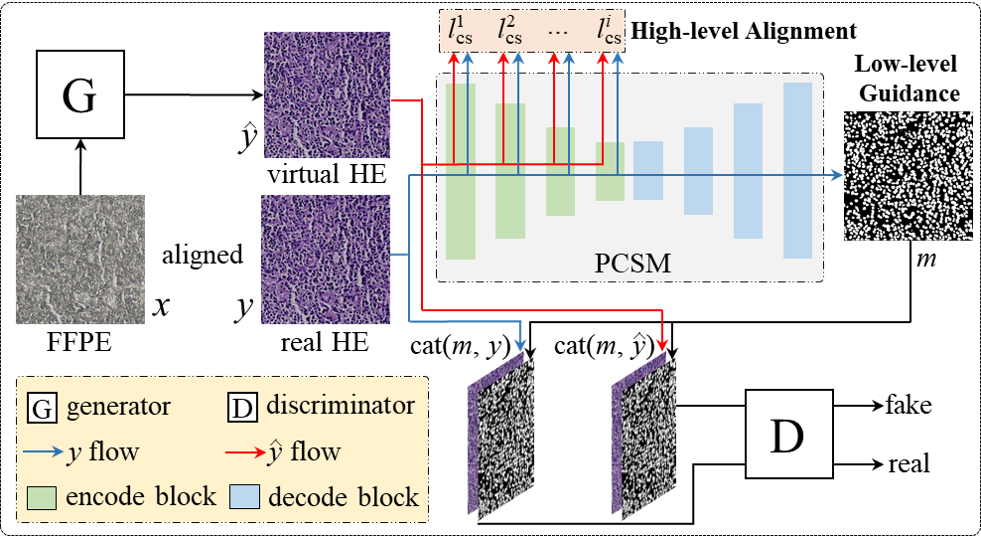

# [MICCAI 2024] Boosting FFPE-to-HE Virtual Staining with Cell Semantics from Pretrained Segmentation Model
*Yihuang Hu, Qiong Peng, Zhicheng Du, Guojun Zhang, Huisi Wu, Jingxin Liu, Hao Chen, Liansheng Wang†*
<div align=left></div>

## Installation
- Clone this repo:
```shell
git clone https://github.com/huyihuang/FFPE-to-HE && cd FFPE-to-HE
```
- Create a conda environment and activate it:
```shell
conda env create -f py38.yml
conda activate py38
```

## Data Preprocess
- We first construct the dataset in `[DATASET DIR]` as the following format:
```bash
[DATASET DIR]
     ├────── trainA
                ├────── train_1.jpg
                ├────── train_2.jpg
                             :
                └────── train_N.jpg
     ├────── trainB
                ├────── train_1.jpg
                ├────── train_2.jpg
                             :
                └────── train_N.jpg
     ├────── testA
                ├────── test_1.jpg
                ├────── test_2.jpg
                            :
                └────── test_N.jpg
     └────── testB
                ├────── test_1.jpg
                ├────── test_2.jpg
                            :
                └────── test_N.jpg
```

## Training
- train pix2pixHD without vgg_loss as baseline 
```shell
python train.py --dataroot [DATASET DIR] --name [EXPERIMENT NAME] --no_instance --no_L1_loss --no_vgg_loss --no_cp_loss \
--netD_cat -1 --save_epoch_freq 20 --gpu_ids 0
```
- train pix2pixHD with only the HE image as the input to the discriminator (remove the FFPE image)
```shell
python train.py --dataroot [DATASET DIR] --name [EXPERIMENT NAME] --no_instance --no_L1_loss --no_vgg_loss --no_cp_loss \
--netD_cat 0 --save_epoch_freq 20 --gpu_ids 0
```
- train pix2pixHD with our method (use cp_loss and cell segmentation mask)
```shell
python train.py --dataroot [DATASET DIR] --name [EXPERIMENT NAME] --no_instance --no_L1_loss --no_vgg_loss \
--netD_cat 1 --save_epoch_freq 20 --gpu_ids 0
```

## Inference
```shell
python test_epochs_imgAndcrit.py --dataroot [DATASET DIR] --name --name [EXPERIMENT NAME] \
--no_instance --loadSize 1024 --nThreads 10 --phase test --gpu_ids 0
```
## Note
- Our implementation builds on the following publicly available codes.
  - [Pix2pixHD](https://github.com/NVIDIA/pix2pixHD) - Wang, Ting-Chun, et al. "High-resolution image synthesis and semantic manipulation with conditional gans." Proceedings of the IEEE conference on computer vision and pattern recognition. 2018.

## Citation
Please cite our paper if this work is helpful to your research.

## Contact
If you have any questions, please contact Yihuang Hu (huyihuang@stu.xmu.edu.cn).
